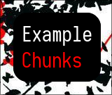
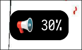

# Chunks-rs
[](https://crates.io/crates/chunks-rs)

A library that simplifies the process of making widgets for Wayland Compositors.

<div style="display: flex; align-items: center;">
    
    
    
</div>

Chunks uses GTK4 and GTK4 Layer Shell at its core, and comes stock with a listener for the Hyprland IPC. This helps with changing Widget states when something changes, such as making the current window fullscreen.

## Usage

Make sure you have GTK4 and GTK4-Layer-Shell installed on your system.

> For more in depth examples, please refer to [example-chunks](https://github.com/drkrssll/example-chunks)

```toml
[dependencies]
chunks-rs = "0.6.2"
```

This will create a storage widget, similar to the one in the screenshot:
```rs
const STYLE: &str = "
window {
    background-color: transparent;
}

#storage {
    font-size: 34px;
    background-color: #000000;
    color: #FFFFFF;
}
";

fn main() {
    let factory = Factory::new("chunk.factory");

    let chunks = |factory: Application| {
        storage(&factory);

        load_css(STYLE);
    };

    factory.pollute(chunks);
}

fn storage(factory: &Application) {
    let tag = tag_label("storage");
    let margins = vec![(Edge::Top, 20), (Edge::Right, 160)];
    let anchors = EdgeConfig::TOP_RIGHT.to_vec();

    let storage_closure = || {
        let text = format!(
            "<span foreground='#FFFFFF'>{:.0}%</span>",
            Internal::get_storage(),
        );
        text
    };

    Internal::update_storage(&tag, storage_closure);

    Chunk::new(
        factory.clone(),
        "Storage".to_string(),
        tag,
        margins,
        anchors,
        Layer::Bottom,
    )
    .build();
}
```

## Slabs & Plates

Chunks has two types of Popup widgets:
- Slabs: Display dynamically, triggered by changes in underlying text (e.g., volume detection).
- Plates: Display once at startup, then disappear after a set duration (e.g., welcome messages).

Both share similar implementations but differ in their display behavior.

> These widget types do not need a designated layer, as they are set to Overlay by default.
```rs
Slab::new(
    factory.clone(),
    "Volume".to_string(),
    tag,
    margins,
    anchors,
    2,
)
.build();
```

```rs
Plate::new(
    factory.clone(),
    "Greeter".to_string(),
    tag,
    margins,
    anchors,
    2,
)
.build();
```

## Bars

Chunks recently added a new widget type - Bars - which are used to display a taskbar, similar to Waybar or Polybar. These taskbars are broken down into a collection of widgets, such as a clock, a workspace switcher, and a system tray.

Bar implementation is similar to the other widgets, but with a few key differences:
- Takes a vector of Tags, which are used to determine a collection of widgets to be displayed on the taskbar.
- Takes an Orientation type (Horizontal or Vertical) to determine the layout of the taskbar.

```rs
fn bar(factory: &Application) {
    let mut workspaces = vec![];

    for i in 0..5 {
        let workspace = tag_button("workspace");
        let num = i + 1;

        Internal::static_button(&workspace, move || {
            switch_workspace(num).expect("Failed to switch workspace")
        });

        Internal::static_widget(&workspace, (num).to_string());

        workspaces.push(workspace);
    }

    let margins = vec![(Edge::Top, 6), (Edge::Bottom, 6), (Edge::Left, 6)];

    let anchors = vec![(Edge::Top, true), (Edge::Left, true), (Edge::Bottom, true)];

    Bar::new(
        factory.clone(),
        "Storage".to_string(),
        workspaces,
        margins,
        anchors,
        Vertical,
    )
    .build();
}

fn switch_workspace(number: i32) -> Result<(), std::io::Error> {
    Command::new("hyprctl")
        .args(&["dispatch", "workspace", &number.to_string()])
        .output()?;

    Ok(())
}
```

The switch_workspace function is used to switch workspaces using hyperctl, a command-line tool for the Hyprland IPC. This is then passed through to your Tag using static_button, which gives your button functionality.

When implementing Tags of the button type, you can use virtually any function in place of switch_workspace.
